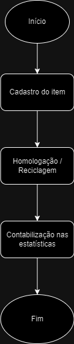
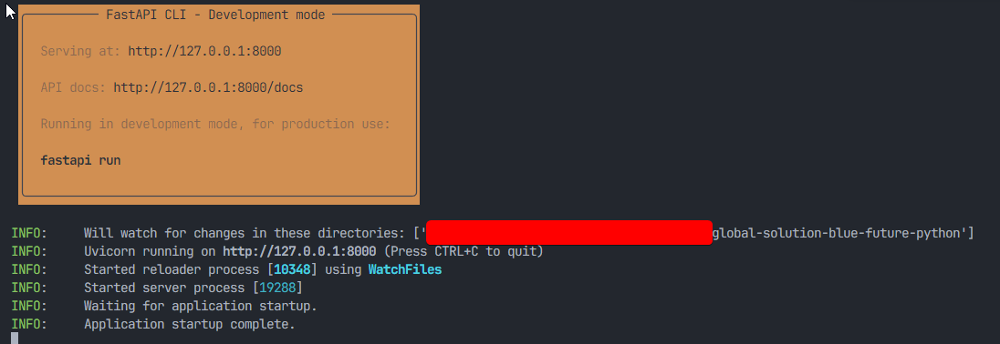

# Global Solution - Blue Future - Python

Este repositório faz parte da Global Solution do primeiro semestre do curso de engenharia de software na FIAP ( 2024 ).

A entrega é correspondente à matéria de Computational Thinking with Python.

## Alunos Participantes

- Arthur Cotrick Pagani - RM: 554510
- Gabriel Danius Fachetti Barbosa - RM: 555747
- Vitor Chaves de Lima Coelho - RM: 555767

## Solução proposta

O Brasil enfrenta um grave problema de gestão de resíduos, com cerca de 3,44 milhões de toneladas de plástico sendo despejadas nos oceanos anualmente, acumulando entre 86 e 150 milhões de toneladas de resíduos plásticos nas águas oceânicas. Apesar de ser o quarto maior consumidor de plásticos no mundo, o país carece de uma legislação eficiente para restringir o uso desse material e recicla apenas 1,3% do plástico, bem abaixo da média mundial de 9%. No Amazonas, o descarte inadequado de resíduos urbanos contamina os lençóis freáticos, agravando a situação ecológica. Em Porto Alegre, a poluição contribuiu para uma grande inundação em maio de 2024. A reciclagem de lixo eletrônico é essencial para evitar a contaminação ambiental, mas a falta de rastreamento eficaz de resíduos pelas empresas impede a implementação de políticas públicas adequadas e soluções inovadoras para a gestão sustentável de resíduos.

A solução proposta é a criação de uma plataforma que utiliza blockchain para rastrear os resíduos produzidos por empresas. A plataforma criará uma métrica de reciclabilidade, monitorando o destino que as empresas dão aos seus resíduos. Com base nessa métrica, será criado um selo de sustentabilidade, que poderá ser obtido por empresas que atingirem uma quantidade significativa de resíduos reciclados. Isso garantirá transparência e confiabilidade nos dados, incentivando práticas sustentáveis.

## Detalhes do projeto

O projeto consiste em uma API que simula o fluxo de cadastro e rastreabilidade dos resíduos produzidos pelas empresas. Esta API possui quatro endpoints, que serão detalhados na seção de [instruções de uso](#instruções-de-uso).

## Instruções de Uso

A API possuí 4 endpoints:

### **/{company}/statistics**
- Método: **GET** 
- Descrição: Lista as estatísticas gerais de uma empresa

O campo *{company}* corresponde ao shortname de uma empresa, ele pode ser substituido pelos seguintes valores:

- **gsl**: Global Solutions Ltd. ( Empresa fictícia )
- **shs**: Stellar Health Services ( Empresa fictícia )
- **fvt**: Future Vision Technologies ( Empresa fictícia )

### **/{company}/statistics/{state}**
- Método: **GET** 
- Descrição: Lista as estatísticas de uma empresa por estado

O campo *{company}* corresponde ao shortname de uma empresa, ele pode ser substituido pelos seguintes valores:

- **gsl**: Global Solutions Ltd. ( Empresa fictícia )
- **shs**: Stellar Health Services ( Empresa fictícia )
- **fvt**: Future Vision Technologies ( Empresa fictícia )

O campo *{state}* corresponde ao estado selecionado para obter as estatísticas, os valores selecionados são:

- **sp**: São Paulo
- **rj**: Rio de Janeiro
- **mg**: Minas Gerais
- **ba**: Bahia

### **/{company}/items**
- Método: **POST** 
- Descrição: Cadastra um novo item ( resíduos ou embalagens ) na lista de items de uma empresa

O campo *{company}* corresponde ao shortname de uma empresa, ele pode ser substituido pelos seguintes valores:

- **gsl**: Global Solutions Ltd. ( Empresa fictícia )
- **shs**: Stellar Health Services ( Empresa fictícia )
- **fvt**: Future Vision Technologies ( Empresa fictícia )

O body desta requisição possuí o seguinte modelo, é necessário que o tipo da requisição seja **application/json**.

```json
{
    "token": "uuid",
    "item_type": "plastic_box | can | plastic_bottle | glass_bottle",
    "state": "sp | rj | mg | ba"
}
```

**OBS:** Um novo item ainda não foi processado / reciclado, logo, deve aparecer no campo raw das estatísticas

**OBS:** O campo token é um UUID, você pode gerar um pelo site https://www.uuidgenerator.net/version4

### **/recycle/{item_token}**
- Método: **POST** 
- Descrição: Marca um item como recliclado

O campo *{item_token}* deve ser substituído por um token de um item cadastrado através do endpoint **/{company}/items**.

### FUNCIONAMENTO

O fluxo abaixo demonstra o ciclo de vida de um item ( resíduos ou embalagens ) na aplicação



## Instalação de dependências e execução

O projeto possuí algumas dependências e para a sua execução precisamos instalá-las. A melhor forma de fazer isto é criar um virtual env do python.

```cmd
python -m venv venv
```

Após a criação do virtual env devemos ativá-lo e instalar as dependências utilizando os dois comandos abaixo.


```cmd
./venv/Scripts/activate # Ativa o virtual env
pip install -r requirements.txt # Instala as dependências
``` 

Após a instalação das dependências o projeto pode ser executado utilizando o comando abaixo:
```
fastapi dev
```

Se as dependências forem instaladas corretamente as seguintes mensagens irão aparecer no terminal



## Como utilizar a API?

É possível acessar o swagger da api utilizando a seguinte URL:

```
http://localhost:8000/docs
```

Como alternativa, existe uma collection do Postman na pasta /docs/